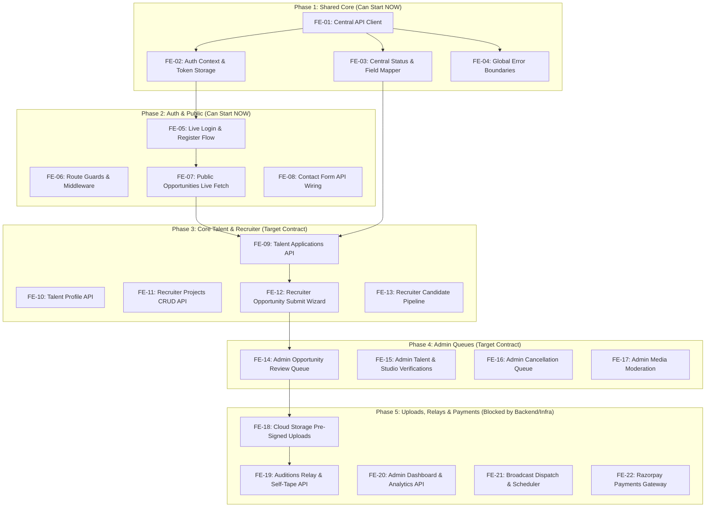

# Vismaya Casting & Talent Platform
## Comprehensive Frontend Integration-Readiness Audit
**Branch**: `kashish` | **Environment**: Next.js 16 (App Router) | **Date**: 07 Oct 2026 | **Audit Mode**: Read-Only

---

## 1. Executive Summary & Audit Metrics

This audit evaluates the frontend codebase (`/frontend`) against the backend contract (`/vismaya-backend/vismaya-backend`) and the reference *Vismaya - Backend vs Frontend Gap Report (06 Oct 2026)*. 

The frontend UI is visually mature, interactive, and responsive. However, it operates **100% on client-side mock state** (`lib/shared/workflowStore.js`, `lib/talent/TalentContext.js`, `lib/admin/AdminContext.js`, `lib/recruiter/RecruiterContext.js`, and `localStorage`). **No real API requests are dispatched anywhere in the frontend.**

### Summary Counts

```
========================================================================
Total Application Routes Audited           : 42 routes
Total Workflow Store Functions & Selectors : 33 (23 actions + 10 selectors)
Total Standalone Context Actions Audited   : 38 actions across 3 contexts
Total Frontend Action Items Identified     : 22 tasks (FE-01 to FE-22)
========================================================================
Tasks by Effort   : S (Small): 6  | M (Medium): 11 | L (Large): 5
Tasks by Timeline : 
  - Ready to Build NOW (No Backend Dependency) : 9 tasks (40.9%)
  - Target Contract Ready (Code now, test later): 8 tasks (36.4%)
  - Blocked by Backend Implementation          : 5 tasks (22.7%)
========================================================================
```

---

## 2. Phase 1: Frontend Data-Source Inventory

### 2.1 Central Store: `lib/shared/workflowStore.js`
The store persists application state to `localStorage` under the key `vismaya_workflow_store_v2`.

#### Store State Entities
- `organizations`: Initial seed of 2 studios (`org-1` Zee Films, `org-2` Dharma Productions)
- `projects`: Initial seed of 4 projects (`proj-1` to `proj-4`)
- `opportunities`: Initial seed of 8 opportunities (`opp-101` to `opp-108`)
- `applications`: Initial seed of 7 applications (`app-1` to `app-7`)
- `auditions`: Initial seed of 3 auditions (`aud-1` to `aud-3`)
- `cancellationRequests`: Initial seed of 2 cancellation tickets (`cr-1`, `cr-2`)
- `notifications`: Initial seed of 5 role-based notifications (`notif-1` to `notif-5`)
- `broadcasts`: Initial seed of 3 admin broadcasts (`bc-1` to `bc-3`)

#### Exposed Actions & Selectors Inventory

| Function / Selector | Type | What it Reads / Writes | Entities Touched | Consuming Pages & Components |
| :--- | :--- | :--- | :--- | :--- |
| `getOpportunity(id)` | Selector | Reads single opportunity | `opportunities` | `opportunities/[id]`, `talent/opportunities/[id]`, `admin/opportunity-review` |
| `getProject(id)` | Selector | Reads single project | `projects` | `opportunities/page.js`, `recruiter/projects/[id]`, `admin/projects` |
| `getOrganizationProjects(orgId)` | Selector | Filters projects by orgId | `projects` | `recruiter/dashboard`, `recruiter/projects`, `recruiter/opportunities/new` |
| `getProjectOpportunities(projId)` | Selector | Filters opps by projectId | `opportunities` | `recruiter/projects/[id]`, `admin/projects` |
| `getOpportunityApplications(oppId)` | Selector | Filters applications by oppId | `applications` | `recruiter/opportunities/[id]/applicants`, `admin/applications` |
| `getTalentApplications(talentId)` | Selector | Filters applications by talentId | `applications` | `talent/dashboard`, `talent/applications` |
| `getApplicationAuditions(appId)` | Selector | Filters auditions by appId | `auditions` | `talent/auditions`, `recruiter/applications/[id]` |
| `getOpportunityAuditions(oppId)` | Selector | Filters auditions by oppId | `auditions` | `recruiter/shortlist-auditions`, `admin/auditions` |
| `getNotificationsForRole(role)` | Selector | Filters notifications by role | `notifications` | `TalentTopbar`, `RecruiterTopbar`, `AdminTopbar` |
| `unreadNotificationsCount(role)` | Selector | Counts unread notifications | `notifications` | `TalentSidebar`, `RecruiterSidebar`, `AdminSidebar` |
| `createProject(payload)` | Action | Appends project | `projects`, `notifications` | `recruiter/projects`, `recruiter/opportunities/new` |
| `markProjectCompleted(id)` | Action | Sets `status: "Completed"` | `projects` | `recruiter/projects/[id]` |
| `submitOpportunity(payload, isDraft)` | Action | Creates/updates opportunity | `opportunities`, `notifications` | `recruiter/opportunities/new` |
| `adminApproveAndPublish(oppId)` | Action | Sets `status: "Published"` | `opportunities`, `notifications` | `admin/opportunity-review` |
| `adminRequestChanges(oppId, note)` | Action | Sets `status: "Changes Requested"` | `opportunities`, `notifications` | `admin/opportunity-review` |
| `adminReject(oppId, reason)` | Action | Sets `status: "Rejected"` | `opportunities`, `notifications` | `admin/opportunity-review` |
| `requestCancellation(oppId, reason)` | Action | Sets `status: "Cancellation Requested"` | `opportunities`, `cancellationRequests` | `recruiter/opportunities` |
| `adminResolveCancellation(reqId, decision)` | Action | Sets `status: "Cancelled"` or reverts | `opportunities`, `cancellationRequests` | `admin/cancellation-requests` |
| `markOpportunityCompleted(oppId)` | Action | Sets `status: "Completed"` | `opportunities` | `recruiter/opportunities` |
| `applyToOpportunity(payload)` | Action | Creates application | `applications`, `notifications` | `OpportunityApplyModal`, `talent/opportunities/[id]` |
| `withdrawApplication(appId)` | Action | Sets `status: "Withdrawn"` | `applications` | `ApplicationCard`, `talent/applications` |
| `setApplicationStatus(appId, status)` | Action | Updates stage / shortlist / select | `applications`, `notifications` | `recruiter/opportunities/[id]/applicants`, `admin/applications` |
| `openApplication(appId)` | Action | Sets `status: "Under Review"` | `applications` | `recruiter/applications/[id]` |
| `requestAudition(payload)` | Action | Creates `status: "Requested"` | `auditions`, `notifications` | `recruiter/applications/[id]` |
| `adminRelayAudition(audId, notes)` | Action | Sets `status: "Relayed to Talent"` | `auditions`, `notifications` | `admin/auditions` |
| `submitSelfTape(audId, payload)` | Action | Sets `status: "Self-tape Received"` | `auditions`, `notifications` | `talent/auditions` |
| `adminForwardSelfTape(audId, notes)` | Action | Sets `status: "Forwarded to Organization"` | `auditions`, `notifications` | `admin/auditions` |
| `markNotificationRead(id)` | Action | Sets `read: true` | `notifications` | `NotificationItem`, `talent/notifications`, `recruiter/notifications` |
| `markAllNotificationsRead(role)` | Action | Marks all as read for role | `notifications` | `talent/notifications`, `recruiter/notifications`, `admin/notifications` |
| `sendBroadcast(payload)` | Action | Appends broadcast | `broadcasts`, `notifications` | `admin/analytics`, `admin/notifications` |
| `saveBroadcastDraft(payload)` | Action | Saves draft broadcast | `broadcasts` | `admin/notifications` |
| `cancelScheduledBroadcast(id)` | Action | Cancels scheduled broadcast | `broadcasts` | `admin/notifications` |
| `resetDemoData()` | Action | Clears localStorage and reseeds | All state | `AdminSidebar`, `RecruiterSidebar` |

### 2.2 Domain Contexts & Parallel Mock Stores

1. **`lib/talent/TalentContext.js`** (296 lines):
   - Seeds from `lib/talent/mockData.js`.
   - Manages: `profile`, `portfolio`, `castingCalls`, `applications`, `notifications`, `toasts`.
   - Contains 7 explicit `// TODO: API - ...` comments for endpoints like `PUT /api/talent/profile`, `POST /api/talent/portfolio/upload`, `POST /api/talent/applications`.
2. **`lib/admin/AdminContext.js`** (1,082 lines):
   - Seeds from `lib/admin/mockData.js`.
   - Manages: `talents`, `recruiters`, `mediaQueue`, `requirementRequests`, `castingCalls`, `applications`, `shortlists`, `bookings`, `payments`, `subscriptions`, `broadcasts`, `notifications`.
   - Contains 26 explicit `// TODO: API - ...` comments for endpoints like `PATCH /api/admin/talents/:id/approve`, `PATCH /api/admin/media/:id/approve`, `POST /api/admin/payments`.
3. **`lib/recruiter/RecruiterContext.js`** (278 lines):
   - Seeds from `lib/recruiter/mockData.js`.
   - Manages: `companyProfile`, `requirements`, `shortlistedTalent`, `notifications`, `activities`.
   - Contains 8 explicit `// TODO: API - ...` comments.

### 2.3 How Authentication & Role Switching is Simulated Today
- **Login Screen** (`app/login/page.js`): Contains 3 "Quick Demo Workspace" buttons directly linking to `/talent/dashboard`, `/recruiter/dashboard`, and `/admin/dashboard`. Form submission is intercepted with `e.preventDefault()` and does nothing.
- **Register Screen** (`app/register/page.js`): Toggles local state `selectedRole` ("talent" vs "organization") and links to `/recruiter/dashboard` or `/talent/dashboard`.
- **Public Guest vs Logged-in View** (`app/opportunities/[opportunityId]/page.js`): Reads a mock boolean `localStorage.getItem("vismaya_demo_logged_in")` to simulate whether the viewer is an authenticated talent (showing audition sides and full scripts).
- **Navigation Topbars**: Topbars render hardcoded avatars and navigate across routes without session tokens.

### 2.4 Static Imports & Hardcoded External Data Sources
- **`lib/public/homeData.js`**: Hardcoded statistics (`12,400+` verified artists, `450+` casting calls, `180+` production houses, `98.4%` audit rate) and partner brand logos for `app/page.js`.
- **`app/about/page.js`** & **`app/contact/page.js`**: Hardcoded office addresses, emails, and platform features.
- **`lib/admin/mockData.js`**: Contains `initialAnalyticsData` (chart coordinates, registration trajectories, category distribution, city breakdown) consumed by `app/admin/analytics/page.js`.

---

## 3. Phase 2: Per-Page Integration Audit

### 3.1 Public & Authentication Area

| Route & File | Data Read & Fields Displayed | UI Actions & Current Store Function | Target Backend API Endpoint | Frontend Changes Needed for Real API | Effort & Risk |
| :--- | :--- | :--- | :--- | :--- | :--- |
| **`/` (Landing Page)**<br>`app/page.js` | `homeData.js` stats, featured opportunities from `workflowStore` | None | `GET /api/public/stats`<br>`GET /api/opportunities/published`<br>`GET /api/success-stories` | Wire async `Promise.all` fetch; add skeleton loaders for cards and stats strip; handle empty stories. | **S**<br>*Low risk* |
| **`/about`**<br>`app/about/page.js` | Static editorial text | None | None (Static) | None. | **S**<br>*Zero risk* |
| **`/contact`**<br>`app/contact/page.js` | Static contact info | Submit contact form | `POST /api/contact` *(Contract pending)* | Wire form submit with payload `{ name, email, subject, message, role }`; add loading/disabled state and success toast. | **S**<br>*Low risk* |
| **`/login`**<br>`app/login/page.js` | Form values (email, password) | Direct `<Link>` navigation | `POST /api/auth/login` | Connect `fetch` to `/api/auth/login`; store JWT in auth storage; redirect to user role's dashboard (`/talent/dashboard`, `/recruiter/dashboard`, `/admin/dashboard`); display backend validation error messages. | **M**<br>*High risk: Blocks all authenticated pages* |
| **`/register`**<br>`app/register/page.js` | Role selector, name, email, password | Direct `<Link>` navigation | `POST /api/auth/register` | Connect `fetch` to `/api/auth/register`; payload: `{ email, password, role, name, studioName }`; store token and redirect to onboarding profile. | **M**<br>*High risk: Blocks onboarding* |
| **`/opportunities`**<br>`app/opportunities/page.js` | `opportunities` (title, summary, type, location, remuneration, deadline, roles) | Filter / search inputs (in-memory) | `GET /api/opportunities/published` *(with `optionalAuth`)* | Replace `useWorkflow().opportunities` with API query; move search/filter query parameters to URLSearchParams; add skeleton grid. | **M**<br>*Medium risk: Public SEO page* |
| **`/opportunities/[opportunityId]`**<br>`app/opportunities/[opportunityId]/page.js` | `getOpportunity(id)`: summary, brief, roles, compensation, script attachments | Demo login toggle (`localStorage`) | `GET /api/opportunities/:id` *(with `optionalAuth`)* | Fetch opportunity by MongoDB ObjectId; derive `isLoggedIn` from real auth token; render guest preview if unauthenticated. | **M**<br>*Medium risk* |

---

### 3.2 Talent Area (`/talent`)

| Route & File | Data Read & Fields Displayed | UI Actions & Current Store Function | Target Backend API Endpoint | Frontend Changes Needed for Real API | Effort & Risk |
| :--- | :--- | :--- | :--- | :--- | :--- |
| **`/talent/dashboard`**<br>`app/talent/dashboard/page.js` | Profile summary, completion %, applications count, pending auditions, recent alerts | Dismiss notification, navigate | `GET /api/talent/profile/my`<br>`GET /api/applications/my`<br>`GET /api/auditions/my`<br>`GET /api/notifications` | Fetch user dashboard aggregates; adapt response shapes; show skeleton cards during initial load. | **M**<br>*Medium risk* |
| **`/talent/profile`**<br>`app/talent/profile/page.js` | Full profile (personal, physical, skills, languages, experience, training, socials) | `updateProfile` in `TalentContext` | `GET /api/talent/profile/my`<br>`POST /api/talent/profile` | Adapt nested profile objects to backend schema; implement save button with network loading state and error handling. | **M**<br>*High risk: Complex form* |
| **`/talent/portfolio`**<br>`app/talent/portfolio/page.js` | Media cards (headshots, video clips, audio, docs, status badge) | `addMedia`, `deleteMedia` in `TalentContext` | `GET /api/media/my`<br>`POST /api/media`<br>`DELETE /api/media/:id` | Backend accepts `{ url, type, title }`. Implement pre-upload to storage (e.g. S3/R2/Cloudinary) then call API; delete confirmation. | **L**<br>*High risk: File upload infrastructure needed* |
| **`/talent/opportunities`**<br>`app/talent/opportunities/page.js` | Published opportunities, roles, remuneration, deadline | Open apply modal | `GET /api/opportunities/published` | Connect to live opportunities endpoint; map status and deadline checks. | **S**<br>*Low risk* |
| **`/talent/opportunities/[opportunityId]`**<br>`app/talent/opportunities/[opportunityId]/page.js` | Detailed brief, roles list, custom questions, eligibility | `applyToOpportunity` via `OpportunityApplyModal` | `GET /api/opportunities/:id`<br>`POST /api/applications/:id/apply` | Load full brief via API; pass `roleId` and `customAnswers[]` to application API payload. | **M**<br>*Medium risk* |
| **`/talent/applications`**<br>`app/talent/applications/page.js` | Applications list, project title, role, status badge, stage stepper | `withdrawApplication`, `requestReapplication` | `GET /api/applications/my`<br>`PATCH /api/applications/:id/withdraw`<br>`POST /api/applications/:id/reapplication-request` | Map backend status enums (`applied`, `under_review`, `shortlisted`, `selected`, `not_selected`, `withdrawn`); wire withdraw & re-apply modals to real endpoints. | **M**<br>*Medium risk* |
| **`/talent/auditions`**<br>`app/talent/auditions/page.js` | Auditions list, instructions, script sides, self-tape status | `submitSelfTape` via video upload modal | `GET /api/auditions/my`<br>`POST /api/auditions/:id/self-tape` | Wire video file upload (direct upload to cloud storage) and send `{ videoUrl, notes }` to backend; handle relay status visibility. | **L**<br>*High risk: Cloud video upload* |
| **`/talent/notifications`**<br>`app/talent/notifications/page.js` | Notifications list, type, timestamp, read status | `markNotificationRead`, `markAllNotificationsRead` | `GET /api/notifications`<br>`PATCH /api/notifications/:id/read`<br>`PATCH /api/notifications/read-all` | Replace `getNotificationsForRole("talent")` with API calls; optimistic read state update. | **S**<br>*Low risk* |
| **`/talent/settings`**<br>`app/talent/settings/page.js` | Account info, password form, sessions list, notification toggles | Update password, sign out session | `POST /api/auth/change-password` *(Contract pending)*<br>`GET/DELETE /api/auth/sessions` *(Contract pending)* | Wire password change form to backend; connect active sessions list and termination API. | **M**<br>*Medium risk* |

---

### 3.3 Recruiter / Organization Area (`/recruiter`)

| Route & File | Data Read & Fields Displayed | UI Actions & Current Store Function | Target Backend API Endpoint | Frontend Changes Needed for Real API | Effort & Risk |
| :--- | :--- | :--- | :--- | :--- | :--- |
| **`/recruiter/dashboard`**<br>`app/recruiter/dashboard/page.js` | Org projects count, active briefs, applicant counts, shortlisted counts | Navigate, quick actions | `GET /api/projects`<br>`GET /api/opportunities/my-opportunities` | Calculate dashboard aggregates from real organization projects & opportunities; add loading shimmer. | **M**<br>*Low risk* |
| **`/recruiter/projects`**<br>`app/recruiter/projects/page.js` | Projects grid, title, type, description, opportunities count | `createProject` modal | `GET /api/projects`<br>`POST /api/projects` | Wire project creation form `{ title, type, description }` to `POST /api/projects`; refresh projects list on success. | **S**<br>*Low risk* |
| **`/recruiter/projects/[projectId]`**<br>`app/recruiter/projects/[projectId]/page.js` | Project details, linked opportunities, status tabs | `markProjectCompleted`, edit project | `GET /api/projects/:id`<br>`PATCH /api/projects/:id` | Fetch project and its opportunities from backend; wire project status updates. | **M**<br>*Low risk* |
| **`/recruiter/opportunities`**<br>`app/recruiter/opportunities/page.js` | Org opportunities list, status tabs, applicant count | `requestCancellation` | `GET /api/opportunities/my-opportunities`<br>`POST /api/opportunities/:id/cancel-request` | Map backend status enums; wire cancellation modal to send `{ reason }` to `/cancel-request`. | **M**<br>*Low risk* |
| **`/recruiter/opportunities/new`**<br>`app/recruiter/opportunities/new/page.js` | Wizard state: project selector, roles builder, eligibility, budget | `submitOpportunity` (draft vs submit) | `POST /api/opportunities`<br>`PATCH /api/opportunities/:id` *(Contract pending)*<br>`POST /api/opportunities/:id/submit` *(Contract pending)* | **CRITICAL PAYLOAD ADAPTER**: Adapt wizard fields to backend schema (flatten `roles[]` to `role` / `positionsCount` OR submit target contract array); handle draft vs live submission. | **L**<br>*High risk: Complex multi-step wizard* |
| **`/recruiter/opportunities/[opportunityId]/applicants`**<br>`app/recruiter/opportunities/[opportunityId]/applicants/page.js` | Applicants pipeline: profile, showreel, status columns | `setApplicationStatus` (shortlist, select, not selected) | `GET /api/applications/opportunity/:id`<br>`PATCH /api/applications/:id/shortlist`<br>`PATCH /api/applications/:id/select`<br>`PATCH /api/applications/:id/not-selected` | Replace in-memory array filtering with live API calls; wire pipeline status buttons to respective patch endpoints. | **M**<br>*Medium risk* |
| **`/recruiter/applications/[applicationId]`**<br>`app/recruiter/applications/[applicationId]/page.js` | Talent details, audition clip, cover note, custom answers | `requestAudition` | `GET /api/applications/:id`<br>`POST /api/auditions/application/:id` | Wire audition request modal `{ type, role, sceneBrief, instructions, deadline }` to audition API. | **M**<br>*Medium risk* |
| **`/recruiter/shortlist-auditions`**<br>`app/recruiter/shortlist-auditions/page.js` | Forwarded auditions, submitted self-tapes, rating, feedback | `reviewAuditionSubmission` | `GET /api/auditions/organization`<br>`PATCH /api/auditions/:id/review` | Wire organization feedback form `{ feedback, rating }` to review endpoint; only show self-tapes forwarded by admin. | **M**<br>*Medium risk* |
| **`/recruiter/notifications`**<br>`app/recruiter/notifications/page.js` | Studio alerts, status updates | `markNotificationRead` | `GET /api/notifications`<br>`PATCH /api/notifications/:id/read` | Fetch organization notifications from API. | **S**<br>*Low risk* |
| **`/recruiter/settings`**<br>`app/recruiter/settings/page.js` | Company profile, CIN/GST verification, team list | Update org profile, submit verification | `GET /api/organization/profile`<br>`POST /api/organization/profile`<br>`POST /api/verifications/business` | Wire organization profile form and business verification upload to live backend routes. | **M**<br>*Low risk* |

---

### 3.4 Admin Area (`/admin`)

| Route & File | Data Read & Fields Displayed | UI Actions & Current Store Function | Target Backend API Endpoint | Frontend Changes Needed for Real API | Effort & Risk |
| :--- | :--- | :--- | :--- | :--- | :--- |
| **`/admin/dashboard`**<br>`app/admin/dashboard/page.js` | Platform aggregates: total talents, studios, opportunities, pending reviews, revenue | None (Overview) | `GET /api/admin/dashboard` *(Contract pending)* | Remove fallback constants (`\|\| 3`, `\|\| 1`); wire card metrics to admin dashboard endpoint. | **M**<br>*Low risk* |
| **`/admin/analytics`**<br>`app/admin/analytics/page.js` | Registration charts, category breakdown, revenue trend | `sendBroadcast` | `GET /api/admin/analytics?range=` *(Contract pending)*<br>`POST /api/admin/broadcasts` *(Contract pending)* | Connect chart datasets to analytics endpoint with time-range selector (`7d`, `30d`, `90d`). | **M**<br>*Low risk* |
| **`/admin/talent-management`**<br>`app/admin/talent-management/page.js` | Talent directory: category, city, age, status, completion % | `approveTalent`, `rejectTalent`, `suspendTalent`, `reactivateTalent` | `GET /api/admin/talents` *(Contract pending)*<br>`PATCH /api/admin/users/:id/approve`<br>`PATCH /api/admin/users/:id/reject`<br>`PATCH /api/admin/users/:id/suspend` | Connect table to admin user/talent list; wire action buttons in `ReviewDrawer` and `ReasonModal` to patch endpoints. | **L**<br>*High risk: Core moderation* |
| **`/admin/recruiter-management`**<br>`app/admin/recruiter-management/page.js` | Studio directory: company, CIN/GST, status, briefs count | `verifyRecruiter`, `rejectRecruiter`, `suspendRecruiter` | `GET /api/admin/organizations` *(Contract pending)*<br>`GET /api/admin/verifications/pending`<br>`PATCH /api/admin/verifications/:id/review` | Wire organization list and verification drawer to admin verification review API. | **M**<br>*Medium risk* |
| **`/admin/opportunity-review`**<br>`app/admin/opportunity-review/page.js` | Pending opportunity briefs, roles, budget, recruiter info | `adminApproveAndPublish`, `adminRequestChanges`, `adminReject` | `GET /api/admin/opportunities/pending`<br>`PATCH /api/admin/opportunities/:id/approve`<br>`PATCH /api/admin/opportunities/:id/request-corrections`<br>`PATCH /api/admin/opportunities/:id/reject` | Wire approve, corrections requested (with notes), and reject (with reason) to live endpoints. | **M**<br>*High risk: Core publishing workflow* |
| **`/admin/opportunities`**<br>`app/admin/opportunities/page.js` | Master opportunities table, filters, status counts | View details | `GET /api/admin/opportunities` *(Contract pending)* | Replace in-memory filtering with server-side pagination & status tabs. | **M**<br>*Low risk* |
| **`/admin/projects`**<br>`app/admin/projects/page.js` | Master projects table, studio name, briefs count | View details | `GET /api/admin/projects` *(Contract pending)* | Wire to admin projects listing endpoint. | **S**<br>*Low risk* |
| **`/admin/applications`**<br>`app/admin/applications/page.js` | Master submissions table, applicant name, opportunity, status | `setApplicationStatus`, `bulkUpdateApplications` | `GET /api/admin/applications` *(Contract pending)* | Wire applications master view and status changes. | **M**<br>*Low risk* |
| **`/admin/auditions`**<br>`app/admin/auditions/page.js` | Auditions relay queue: requested auditions & submitted self-tapes | `adminRelayAudition`, `adminForwardSelfTape` | `GET /api/admin/auditions` *(Contract pending)*<br>`PATCH /api/admin/auditions/:id/relay` *(Contract pending)*<br>`PATCH /api/admin/auditions/:id/forward` *(Contract pending)* | Connect relay modal (brief & instructions) and forward modal (video preview & notes) to admin audition endpoints. | **L**<br>*High risk: Custom relay flow* |
| **`/admin/cancellation-requests`**<br>`app/admin/cancellation-requests/page.js` | Cancellation tickets queue, reason, applicant count | `adminResolveCancellation` | `GET /api/admin/cancellation-requests` *(Contract pending)*<br>`PATCH /api/admin/opportunities/:id/review-cancellation` | Wire cancellation decision (approve cancellation vs decline) to backend endpoint. | **M**<br>*Low risk* |
| **`/admin/media-moderation`**<br>`app/admin/media-moderation/page.js` | Media moderation queue: headshots, video reels, user name | `approveMedia`, `rejectMedia` | `GET /api/admin/media` *(Contract pending)*<br>`PATCH /api/admin/media/:id/moderate` *(Contract pending)* | Connect media queue cards to moderation endpoint `{ decision: 'approve'\|'reject'\|'restrict', reason }`. | **M**<br>*Medium risk* |
| **`/admin/payments`**<br>`app/admin/payments/page.js` | Manual accounting ledger, gross, commission, payout | `addPaymentEntry`, `updatePaymentEntry`, `deletePaymentEntry` | `GET /api/admin/payments` *(Contract pending)*<br>`POST /api/admin/payments` *(Contract pending)* | Wire ledger entry modal to manual payments API. | **M**<br>*Low risk* |
| **`/admin/notifications`**<br>`app/admin/notifications/page.js` | System alerts feed, broadcast history, compose panel | `sendBroadcast`, `saveBroadcastDraft`, `cancelScheduledBroadcast` | `GET /api/admin/system-feed` *(Contract pending)*<br>`POST/GET /api/admin/broadcasts` *(Contract pending)* | Wire broadcast composer (rules: In-app always on, SMS/WhatsApp only for Urgent update) and history table. | **L**<br>*Medium risk* |

---

### 3.5 Shared Components Audit

| Component | Current State / Store Dependency | Changes Needed for Integration |
| :--- | :--- | :--- |
| **`components/PublicNav.js`** | Renders static links + "Sign In" | Read auth state from AuthContext; show user avatar / role dashboard link when logged in. |
| **`components/talent/TalentTopbar.js`** | Reads unread count from `workflowStore` / `TalentContext` | Read real user profile name, avatar, and notification unread count from Auth & Notification context. |
| **`components/recruiter/RecruiterTopbar.js`** | Reads unread count from `workflowStore` | Read real studio name, credit balance (`GET /api/credits/balance`), and notifications. |
| **`components/admin/AdminTopbar.js`** | Reads unread count from `workflowStore` | Read admin user info and live system alert count. |
| **`components/talent/OpportunityApplyModal.js`** | Calls `applyToOpportunity` in store | Wire to `POST /api/applications/:id/apply` with payload `{ coverNote, customAnswers, roleId }`; add loading spinner. |
| **`components/talent/ApplicationCard.js`** | Renders hardcoded stage indicators and `app-1` IDs | Map backend application status to stage numbers (1 to 4); wire withdraw action to API. |
| **`components/shared/StatusBadge.js`** | Normalizes Title Case strings only | Connect to central status mapper (`statusMapper.js`) so backend snake_case values render correctly. |
| **`components/shared/DataTable.js`** | Client-side array pagination and sorting | Add support for server pagination callbacks (`onPageChange`, `onSortChange`, `isLoading`). |

---

## 4. Phase 3: Cross-Cutting Architectural Findings (16 Foundation Areas)

### 1. API Client Layer
- **Current State**: No HTTP client exists.
- **Requirement**: Build `lib/api/client.js` with:
  - Base URL resolved from `process.env.NEXT_PUBLIC_API_URL || "http://localhost:5000"`.
  - Automatic `Authorization: Bearer <token>` injection on every request.
  - Automatic JSON request/response envelope handling.
  - Unified error handling rejecting with `{ status, message, errors }`.
  - Global 401 interceptor that clears auth storage and redirects to `/login`.

### 2. Authentication, Storage & Route Protection
- **Token Storage Recommendation**: **`localStorage` for initial integration**, with access token stored under `vismaya_auth_token` and user profile in React memory. 
  - *Rationale*: Backend returns `{ success: true, token: "...", user: {...} }` in JSON bodies and is hosted separately. Using `localStorage` avoids cross-domain CORS cookie / SameSite header complexity. A Next.js API route proxy with httpOnly cookies can be introduced later in production if desired.
- **Route Protection**: Implement a Next.js middleware (`frontend/middleware.js`) and client Layout Guards (`app/talent/layout.js`, `app/recruiter/layout.js`, `app/admin/layout.js`) checking token validity and role authorization:
  - `/talent/*` requires role `talent`
  - `/recruiter/*` requires role `organization`
  - `/admin/*` requires role `admin`
  - Unauthenticated users redirected to `/login?redirect=<path>`

### 3. Role Mapping
- The frontend consistently uses `"recruiter"` in routes (`/recruiter/*`), context names (`RecruiterContext`), and UI labels (*Recruiter*, *Studio*).
- The backend uses `"organization"` as the official database role string in JWT and User model.
- **Rule**: Map `recruiter` ↔ `organization` in the auth layer (`AuthContext.js` and `client.js`). URLs can remain `/recruiter/*` for UX while all API requests send `role: "organization"`.

### 4. Status Mapping
- Complete bidirectional mapping tables must be established (see Section 5 for full tables).
- Every tab filter, status badge, and workflow stepper must consume `statusMapper.js` instead of string equality against Title Case literals.

### 5. ID System & Normalization
- The frontend seed data uses prefixed strings (`opp-101`, `app-7`, `proj-1`, `tal-901`, `org-1`).
- The backend returns 24-character hexadecimal MongoDB `_id` strings (e.g. `6521a9f4c3d2e1b8a901f42a`) and public `vismayaId` for talent (e.g. `VIS-482910`).
- **Adapter Rule**: All API mappers must normalize `_id` to `id` (`id: item._id || item.id`) so UI code continues to access `item.id`.

### 6. Data Shape Adapters (`lib/api/mappers/`)
- Mappers should reside in `lib/api/mappers/` (`opportunityMapper.js`, `applicationMapper.js`, `talentMapper.js`, `auditionMapper.js`).
- Pages must never receive raw backend JSON; mappers will guarantee UI prop safety (handling missing arrays, null objects, date conversions, and status translation).

### 7. Async Behavior & Initial State
- The mock store hydrates synchronously on mount. Pages currently assume data is instantly available, creating potential `TypeError: cannot read properties of undefined` when data fetches asynchronously.
- **Fix**: All pages fetching data must have explicit `isLoading`, `error`, and `data` states, rendering `<Skeleton />` during fetch and `<EmptyState />` on null/empty results.

### 8. Server vs Client Rendering
- All pages currently have `"use client"` because they read React Contexts and `workflowStore`.
- **Recommendation**: Keep `"use client"` on dashboard and authenticated interactive pages for this phase. Public pages (`app/page.js`, `app/opportunities/page.js`, `app/opportunities/[opportunityId]/page.js`) can optionally fetch data via Next.js Server Components for SEO and fast First Contentful Paint.

### 9. Lists at Scale & Server Pagination
- `DataTable.js`, `TalentManagementPage`, `OpportunitiesPage`, and `AdminApplicationsPage` currently do `.filter()` and `.slice()` on in-memory arrays.
- Tab counts (e.g., `Pending (12)`, `Approved (45)`) are computed via `.filter().length`.
- **Target Pattern**: For small lists (<100 items), fetch full lists and filter in client memory. For large directories (Talent directory, Opportunities directory), pass `page`, `limit`, `search`, `status` query params to the backend and expect `{ items, totalCount, tabCounts }`.

### 10. File Uploads & Media Storage Architecture
- **Critical Finding**: Backend endpoints (`POST /api/media`, `POST /api/auditions/:id/self-tape`, `POST /api/verifications/identity`) accept **URLs**, not raw `multipart/form-data` binary payloads.
- **Required Architecture**: Direct client upload to cloud storage:
  1. Client requests a pre-signed upload URL or uses a storage provider (AWS S3, Cloudflare R2, Cloudinary, or Supabase Storage).
  2. Browser uploads binary directly to bucket.
  3. Client posts the resulting public HTTPS URL to the Vismaya backend endpoint.

### 11. Public vs Logged-In Views & Privacy Protocol
- Guest users viewing public opportunities (`/opportunities/[opportunityId]`) must see only sanitized fields (`title`, `summary`, `location`, `remuneration`, `deadline`, `roleName`).
- Full casting brief, character side notes, and script attachments must be hidden behind an authenticated talent session.

### 12. Real-Time & Notifications
- The backend is purely REST-based with no WebSockets.
- Topbar unread counters must poll `GET /api/notifications/unread-count` on interval (e.g. every 60 seconds) or refetch on route navigation.

### 13. Form Validation & Backend Error Feedback
- Backend errors arrive in standard shape `{ success: false, message: "...", errors: [...] }`.
- Forms must capture field-level error arrays and render inline red helper text beneath the corresponding `<input>`.

### 14. Payment Gateway (Razorpay Integration)
- Frontend needs Razorpay checkout script (`https://checkout.razorpay.com/v1/checkout.js`).
- Flow: Call `POST /api/payments/create-order` → open Razorpay Modal with `order_id` → on success, call `POST /api/payments/verify` with `razorpay_payment_id` and `razorpay_signature`.

### 15. Environment Configuration & Error Boundaries
- Add `app/error.js` and `app/global-error.js` with a "Try Again" recovery button.
- Add `app/not-found.js` for clean 404 handling.
- Ensure `.env.local` contains `NEXT_PUBLIC_API_URL=http://localhost:5000`.

### 16. Mock / Real Coexistence Switch
- Introduce `process.env.NEXT_PUBLIC_USE_MOCK === "true"` in API client and data hooks so developers can toggle between mock data and real backend endpoints per module during development.

---

## 5. Phase 4: Complete Mapping Tables

### 5.1 Status Mapping Tables

#### Opportunity Status
| Frontend UI Label | UI Normalized Key | Backend Database Value | Notes |
| :--- | :--- | :--- | :--- |
| **Draft** | `draft` | `draft` | *Contract pending in backend* |
| **Submitted** | `submitted` | `pending` | Newly submitted brief |
| **Under Admin Review** | `under-admin-review` | `under_vismaya_review` | Admin actively reviewing |
| **Changes Requested** | `changes-requested` | `corrections_requested` | Sent back to recruiter with notes |
| **Published / Live** | `published` / `live` | `published` | Live on public talent board |
| **Rejected** | `rejected` | `rejected` | Declined by admin |
| **Cancellation Requested** | `cancellation-requested`| `cancellation_requested`| Recruiter requested cancel |
| **Cancelled** | `cancelled` | `cancelled` | Admin approved cancellation |
| **Closed** | `closed` | `closed` | Casting deadline expired |
| **Completed** | `completed` | `completed` | Production finalized |

#### Application Status
| Frontend UI Label | UI Normalized Key | Backend Database Value | Notes |
| :--- | :--- | :--- | :--- |
| **Applied** | `applied` | `applied` | Talent submitted application |
| **Under Review** | `under-review` | `under_review` | Recruiter opened profile |
| **Shortlisted** | `shortlisted` | `shortlisted` | Moved to candidate shortlist |
| **Selected** | `selected` | `selected` | Final candidate booking |
| **Not Selected** | `not-selected` | `not_selected` | Application archived |
| **Withdrawn** | `withdrawn` | `withdrawn` | Talent cancelled submission |

#### Audition Status (including 3 Pending Relay Statuses)
| Frontend UI Label | UI Normalized Key | Backend Database Value | Notes |
| :--- | :--- | :--- | :--- |
| **Requested** | `requested` | `requested` | Studio requested audition |
| **Relayed to Talent** | `relayed-to-talent` | `relayed_to_talent` | *Contract pending*: Admin vetted & sent to talent |
| **Self-tape Received** | `self-tape-received`| `self_tape_received` | *Contract pending*: Talent uploaded tape |
| **Forwarded to Organization**| `forwarded-to-org` | `forwarded_to_org` | *Contract pending*: Admin forwarded tape to studio |
| **Reviewed** | `reviewed` | `reviewed` | Studio provided rating & notes |
| **Completed** | `completed` | `completed` | Finalized |
| **Cancelled** | `cancelled` | `cancelled` | Audition call cancelled |

#### Verification & Media Status
| Entity | Frontend UI Label | Backend Database Value |
| :--- | :--- | :--- |
| **Verification** | Pending / Under Review | `pending` |
| **Verification** | Verified / Approved | `approved` |
| **Verification** | Rejected | `rejected` |
| **Media Item** | Pending Moderation | `pending` |
| **Media Item** | Approved / Live | `approved` |
| **Media Item** | Rejected | `rejected` |
| **Media Item** | Restricted | `restricted` |

---

### 5.2 Role Mapping Table

| Frontend Label | Frontend URL Slug | Backend Token / DB Role | Context Provider |
| :--- | :--- | :--- | :--- |
| **Talent / Artist** | `/talent/*` | `talent` | `TalentContext` |
| **Recruiter / Studio** | `/recruiter/*` | `organization` | `RecruiterContext` |
| **Vismaya Admin** | `/admin/*` | `admin` | `AdminContext` |

---

### 5.3 Entity Data Shape Comparison & Adapter Specifications

```
Opportunity Entity Mapping:
  Frontend (UI Wizard)         Backend (Model)             Adapter Transform
  --------------------         ---------------             -----------------
  id                           _id                         _id -> id
  title                        title                       Direct
  summary                      summary                     Direct
  opportunityType              eligibility.professions     Map to professions array
  roles[]                      role (String)               Target contract: roles[]
                               positionsCount (Number)     Target contract: roles[].positionsCount
  location                     location                    Direct
  deadline                     deadline                    ISO String <-> Date
  remunerationType             remuneration                Combine into string
  remunerationAmount           remuneration                e.g. "Paid (₹50,000 / day)"
  status ("Submitted")         status ("pending")          statusMapper.toBackend(status)

Application Entity Mapping:
  Frontend (UI)                Backend (Model)             Adapter Transform
  --------------------         ---------------             -----------------
  id                           _id                         _id -> id
  opportunityId                opportunityId               Direct
  talentId                     talentId                    Direct
  roleName                     roleId / roleName           Pass in customAnswers if field missing
  applicantNote                coverNote                   Map applicantNote -> coverNote
  status ("Shortlisted")       status ("shortlisted")      statusMapper.toBackend(status)
```

---

## 6. Phase 5: Migration Strategy Evaluation & Recommendation

### Comparison of Integration Strategies

| Criteria | Strategy A: Preserve `useWorkflow()` Interface | Strategy B: Page-by-Page Query Hooks (SWR / React Query) |
| :--- | :--- | :--- |
| **Concept** | Keep `useWorkflow()` hook signatures intact; rewrite internals from `useReducer` to API calls. | Replace store calls in each page with dedicated API hooks (`useOpportunities`, `useMyApplications`). |
| **Page Refactoring** | **Minimal**: ~90% of page code stays identical. | **High**: Every page component rewritten to use new hook signatures. |
| **Caching & Invalidation** | Manual state updates or refetches. | Built-in automatic caching, background revalidation, and mutation invalidation. |
| **Time to Working App** | **Fastest (1-2 weeks)**. | Slower (3-4 weeks). |
| **Mock/Real Switch** | Very easy: toggle internal provider implementation. | Requires mock handlers (MSW) or branching inside each hook. |

### Recommendation: **Hybrid Strategy A+**
1. **Foundation**: Implement a central HTTP client (`lib/api/client.js`) and status/data mappers (`lib/api/mappers/`).
2. **State Layer**: Retain the `useWorkflow()` and `useTalent()` / `useAdmin()` / `useRecruiter()` context signatures, but replace their internal reducer dispatchers with live API client calls.
3. **Outcome**: All 42 pages instantly start communicating with the real backend without requiring UI rewrites, preserving all existing layouts, modals, tabs, and animations.

---

## 7. Phase 6: Prioritized Frontend Action List (FE-01 to FE-22)



### Complete Action Items List

| Task ID | Title | Files Affected | What to Change | Effort | Readiness / Dependency |
| :--- | :--- | :--- | :--- | :---: | :--- |
| **FE-01** | **Central API Client** | Create `frontend/lib/api/client.js` | Create unified `fetch` wrapper using `NEXT_PUBLIC_API_URL`, auto-attaching Bearer token, JSON parsing, 401 redirect, and error shaping. | **S** | **NOW** *(No backend change needed)* |
| **FE-02** | **Auth Context & Storage** | Create `frontend/lib/auth/AuthContext.js` | Create AuthProvider storing JWT in `localStorage`, user profile in state, login/logout functions, and role checks. | **M** | **NOW** *(No backend change needed)* |
| **FE-03** | **Status & Field Mapper** | Create `frontend/lib/api/statusMapper.js` | Create bidirectional lookup maps for Opportunity, Application, Audition, Verification, Media, User statuses; update `StatusBadge.js`. | **S** | **NOW** *(No backend change needed)* |
| **FE-04** | **Global Error Boundaries** | Create `frontend/app/error.js`, `not-found.js` | Build Next.js App Router global error boundary with retry CTA and 404 page matching design theme. | **S** | **NOW** *(No backend change needed)* |
| **FE-05** | **Live Login & Register** | `app/login/page.js`, `app/register/page.js` | Replace `e.preventDefault()` / direct `<Link>` navigation with live `POST /api/auth/login` and `/register`; store JWT and redirect. | **M** | **NOW** *(Backend endpoints exist)* |
| **FE-06** | **Route Guards & Middleware** | Create `frontend/middleware.js` | Implement route middleware checking token presence and verifying role matches for `/talent/*`, `/recruiter/*`, `/admin/*`. | **S** | **NOW** *(No backend change needed)* |
| **FE-07** | **Public Opportunities Live Fetch** | `app/opportunities/page.js`, `[opportunityId]/page.js` | Fetch live published opportunities via API client; adapt guest vs authenticated brief view based on real token. | **M** | **NOW** *(Backend exists; optionalAuth pending)* |
| **FE-08** | **Contact Form API Wiring** | `app/contact/page.js` | Connect form submit to `POST /api/contact` with loading spinner and toast notification. | **S** | **TARGET CONTRACT** *(Backend endpoint pending)* |
| **FE-09** | **Talent Applications API** | `app/talent/applications/page.js`, `OpportunityApplyModal.js` | Wire apply modal to `POST /api/applications/:id/apply`, list to `GET /api/applications/my`, withdraw to `PATCH .../withdraw`. | **M** | **NOW** *(Backend endpoints exist)* |
| **FE-10** | **Talent Profile API** | `app/talent/profile/page.js` | Wire profile GET/POST to `GET /api/talent/profile/my` and `POST /api/talent/profile`; adapt nested schema. | **M** | **NOW** *(Backend endpoints exist)* |
| **FE-11** | **Recruiter Projects API** | `app/recruiter/projects/page.js`, `[projectId]/page.js` | Wire project creation modal to `POST /api/projects`, list to `GET /api/projects`, edit to `PATCH /api/projects/:id`. | **S** | **NOW** *(Backend endpoints exist)* |
| **FE-12** | **Opportunity Submit Wizard** | `app/recruiter/opportunities/new/page.js` | Align payload adapter with backend Opportunity schema; wire live creation to `POST /api/opportunities`. | **L** | **TARGET CONTRACT** *(roles[] vs single role decision)* |
| **FE-13** | **Recruiter Pipeline Actions** | `app/recruiter/opportunities/[id]/applicants/page.js` | Wire shortlist/select/not-selected action buttons to `PATCH /api/applications/:id/shortlist`, `/select`, `/not-selected`. | **M** | **NOW** *(Backend endpoints exist)* |
| **FE-14** | **Admin Opportunity Review Queue** | `app/admin/opportunity-review/page.js` | Wire pending briefs to `GET /api/admin/opportunities/pending`, approve to `.../approve`, corrections to `.../request-corrections`. | **M** | **NOW** *(Backend endpoints exist)* |
| **FE-15** | **Admin Verifications & Users** | `app/admin/talent-management/page.js`, `recruiter-management` | Wire user moderation actions to `PATCH /api/admin/users/:id/approve` and verification review endpoints. | **L** | **NOW** *(Backend endpoints exist)* |
| **FE-16** | **Admin Cancellation Queue** | `app/admin/cancellation-requests/page.js` | Wire decision action to `PATCH /api/admin/opportunities/:id/review-cancellation`. | **M** | **TARGET CONTRACT** *(Queue endpoint pending)* |
| **FE-17** | **Admin Media Moderation** | `app/admin/media-moderation/page.js` | Connect cards to `GET /api/admin/media` and `PATCH /api/admin/media/:id/moderate`. | **M** | **TARGET CONTRACT** *(Backend endpoint pending)* |
| **FE-18** | **Cloud Storage Upload Hook** | Create `frontend/lib/api/uploadMedia.js` | Implement pre-signed URL upload helper for headshots, video showreels, and self-tapes before calling backend URL endpoints. | **L** | **BLOCKED** *(Requires S3/R2 storage setup)* |
| **FE-19** | **Auditions Relay & Self-Tape** | `app/talent/auditions/page.js`, `admin/auditions` | Wire self-tape submission and admin relay/forward actions. | **L** | **BLOCKED** *(Backend relay statuses pending)* |
| **FE-20** | **Admin Dashboard & Analytics** | `app/admin/dashboard/page.js`, `admin/analytics` | Wire metrics and chart datasets to live admin summary endpoints. | **M** | **TARGET CONTRACT** *(Backend endpoints pending)* |
| **FE-21** | **Broadcast Dispatcher** | `app/admin/notifications/page.js` | Wire broadcast form and history table to live broadcast endpoints. | **M** | **TARGET CONTRACT** *(Backend endpoint pending)* |
| **FE-22** | **Razorpay Payments Gateway** | `app/admin/payments/page.js`, Checkout buttons | Integrate Razorpay Checkout SDK with order creation and verification endpoints. | **M** | **BLOCKED** *(Requires Razorpay API keys)* |

---

## 8. Phase 7: Non-Negotiables, Risks & Open Decisions

### 8.1 What Must NOT Be Touched During Integration
1. **Visual Design & Aesthetics**: The luxury dark theme (`#070b12`), gold accents (`#ffbc00`), and glassmorphism styling (`glass` class, backdrop filters).
2. **Responsive Layouts**: Desktop sidebars, mobile bottom navigation bars, and fluid typography.
3. **Animations**: Card hover effects, pulse indicators, modal spring transitions, and custom scrollbars.
4. **Finished Redesigns**: The broadcast management interface (`design-reference/vismaya-broadcasts-redesign.html` / `components/admin/broadcasts/*`).

### 8.2 Open Decisions & Recommendations

1. **Token Storage**:
   - *Options*: `localStorage` vs `httpOnly cookie`
   - *Recommendation*: **`localStorage`** (`vismaya_auth_token`) for initial integration. It avoids cross-domain CORS/cookie mismatch issues during development and testing.
2. **Media & Self-Tape Uploads**:
   - *Options*: Upload binary to backend server vs direct client upload to cloud bucket.
   - *Recommendation*: **Direct client upload to S3 / Cloudflare R2 via pre-signed URLs**. The backend database should only store CDN URLs, preventing large video files from clogging Node.js event loops.
3. **Multi-Role Opportunities**:
   - *Options*: Backend updates model to `roles[]` array vs frontend flattens to 1 role per opportunity.
   - *Recommendation*: **Backend should adopt `roles[]` array subdocuments**. Real casting calls almost always hire for multiple characters (e.g. Lead, Supporting, Extra) in a single production brief.
4. **Audition Relay Workflow**:
   - *Options*: Direct recruiter-to-talent audition vs Vismaya Admin mediation relay.
   - *Recommendation*: **Vismaya Admin Relay (`relayed_to_talent` → `self_tape_received` → `forwarded_to_org`)**. This preserves platform privacy and prevents offline bypass of Vismaya casting services.
